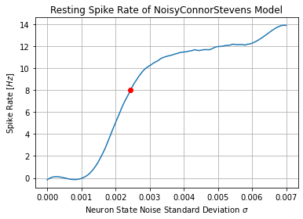
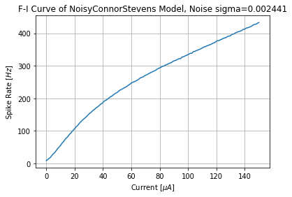
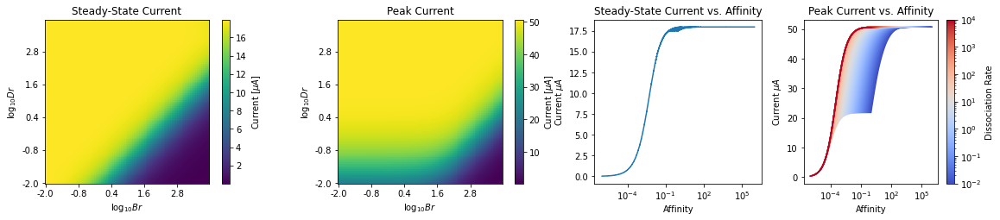
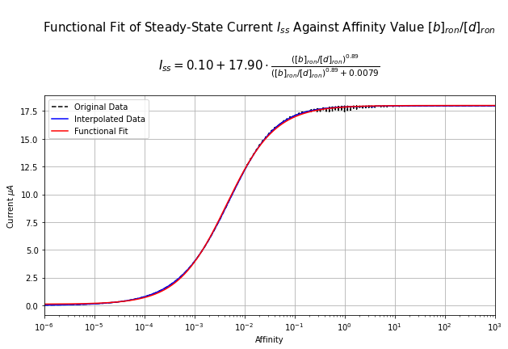

Olfactory Transduction Library
==============================

In this notebook, we demonstrate the various ways that the ``Olftrans``
package is to be consumed by end-users.

Table of Content
~~~~~~~~~~~~~~~~

1. `Estimating Binding & Dissociation Rate From Data (Main Entry
   Point) <#estimate_bd>`__
2. `Computing Resting Spike Rate of BSG <#compute_resting>`__
3. `Computing F-I curve of BSG <#compute_fi>`__
4. `Computing Peak and Stead-State Output of OTP under Step
   Input <#compute_peak_ss_I>`__
5. `Computing Peak and Stead-State Output of OTP-BSG under Step
   Input <#compute_peak_ss_spike>`__
6. `Working with other FlyBrainLab Packages <#fbl>`__

.. code:: ipython3

    import os
    import matplotlib.pyplot as plt
    import numpy as np

# 1. Estimating Binding & Dissociation Rates from Data

In this section, we show an example of estimating binding and
dissociation rates from spike rate data. The data that we will use is
from Hallem & Carlson 2006. The data shows the steady-state spike rates
of odorant-receptor pairs under a step concentration input of 100 ppm.

The processed data is available in the ``Olftrans`` package as
``olftrans.data.HallemCarlson.DATA``.

Assumptions and Data Pre-processing
~~~~~~~~~~~~~~~~~~~~~~~~~~~~~~~~~~~

1. Steady-State Response Assumption:

   -  Note that from the original 2006 publication’s *Experimental
      Procedure* Section: > Responses were quantified by subtracting the
      number of impulses in 500 ms of unstimulated activity from the
      number of impulses in the 500 ms following odorant stimulation,
      unless otherwise indicated.

      We assume that 500 ms is sufficient for the response to reach
      steady-state.

2. Response level calculation:

   -  Note that from the original 2006 publication’s *Figure 1 Caption*:
      > Responses of each receptor to the diluent were subtracted from
      each odorant response

      To take into account the spontaneous firing rate of OSNs
      expressing each receptor type, we add the spontaneous firing rate
      to the reported spike rate by Hallem & Carlson. Note that this is
      consistent with the procedure in *Stevens 2016 PNAS*

3. Negative Spike Rate:

   -  Even after adding the spontaneous firing rates, some of the firing
      rates are still negative. As such, we recify the resulting spike
      rate to be non-negative. Note that this is consistent with the
      procedure in *Stevens 2016 PNAS*

.. code:: ipython3

    from olftrans import olftrans
    from olftrans import data

.. code:: ipython3

    data.HallemCarlson.DATA

.. raw:: html

    

    
    <table border="1" class="dataframe">
      <thead>
        <tr style="text-align: right;">
          <th>OR</th>
          <th>2a</th>
          <th>7a</th>
          <th>9a</th>
          <th>10a</th>
          <th>19a</th>
          <th>22a</th>
          <th>23a</th>
          <th>33b</th>
          <th>35a</th>
          <th>43a</th>
          <th>...</th>
          <th>59b</th>
          <th>65a</th>
          <th>67a</th>
          <th>67c</th>
          <th>82a</th>
          <th>85a</th>
          <th>85b</th>
          <th>85f</th>
          <th>88a</th>
          <th>98a</th>
        </tr>
      </thead>
      <tbody>
        <tr>
          <th>ammonium hydroxide</th>
          <td>11</td>
          <td>0</td>
          <td>35</td>
          <td>24</td>
          <td>30</td>
          <td>17</td>
          <td>7</td>
          <td>16</td>
          <td>21</td>
          <td>20</td>
          <td>...</td>
          <td>7</td>
          <td>21</td>
          <td>27</td>
          <td>16</td>
          <td>18</td>
          <td>8</td>
          <td>28</td>
          <td>24</td>
          <td>26</td>
          <td>36</td>
        </tr>
        <tr>
          <th>putrescine</th>
          <td>14</td>
          <td>0</td>
          <td>29</td>
          <td>0</td>
          <td>20</td>
          <td>16</td>
          <td>7</td>
          <td>21</td>
          <td>17</td>
          <td>4</td>
          <td>...</td>
          <td>4</td>
          <td>16</td>
          <td>7</td>
          <td>12</td>
          <td>12</td>
          <td>1</td>
          <td>37</td>
          <td>15</td>
          <td>20</td>
          <td>29</td>
        </tr>
        <tr>
          <th>cadaverine</th>
          <td>9</td>
          <td>0</td>
          <td>24</td>
          <td>0</td>
          <td>24</td>
          <td>17</td>
          <td>2</td>
          <td>18</td>
          <td>29</td>
          <td>11</td>
          <td>...</td>
          <td>9</td>
          <td>17</td>
          <td>3</td>
          <td>20</td>
          <td>14</td>
          <td>3</td>
          <td>42</td>
          <td>23</td>
          <td>26</td>
          <td>33</td>
        </tr>
        <tr>
          <th>g-butyrolactone</th>
          <td>17</td>
          <td>51</td>
          <td>56</td>
          <td>8</td>
          <td>22</td>
          <td>47</td>
          <td>13</td>
          <td>32</td>
          <td>98</td>
          <td>9</td>
          <td>...</td>
          <td>18</td>
          <td>24</td>
          <td>136</td>
          <td>26</td>
          <td>9</td>
          <td>6</td>
          <td>60</td>
          <td>30</td>
          <td>28</td>
          <td>41</td>
        </tr>
        <tr>
          <th>g-hexalactone</th>
          <td>23</td>
          <td>0</td>
          <td>121</td>
          <td>32</td>
          <td>27</td>
          <td>144</td>
          <td>21</td>
          <td>50</td>
          <td>188</td>
          <td>29</td>
          <td>...</td>
          <td>20</td>
          <td>36</td>
          <td>58</td>
          <td>46</td>
          <td>21</td>
          <td>11</td>
          <td>66</td>
          <td>61</td>
          <td>29</td>
          <td>36</td>
        </tr>
        <tr>
          <th>...</th>
          <td>...</td>
          <td>...</td>
          <td>...</td>
          <td>...</td>
          <td>...</td>
          <td>...</td>
          <td>...</td>
          <td>...</td>
          <td>...</td>
          <td>...</td>
          <td>...</td>
          <td>...</td>
          <td>...</td>
          <td>...</td>
          <td>...</td>
          <td>...</td>
          <td>...</td>
          <td>...</td>
          <td>...</td>
          <td>...</td>
          <td>...</td>
        </tr>
        <tr>
          <th>ethyl decanoate</th>
          <td>13</td>
          <td>5</td>
          <td>5</td>
          <td>57</td>
          <td>12</td>
          <td>10</td>
          <td>8</td>
          <td>26</td>
          <td>7</td>
          <td>13</td>
          <td>...</td>
          <td>5</td>
          <td>14</td>
          <td>4</td>
          <td>3</td>
          <td>12</td>
          <td>0</td>
          <td>41</td>
          <td>5</td>
          <td>21</td>
          <td>24</td>
        </tr>
        <tr>
          <th>ethyl trans-2-butenoate</th>
          <td>19</td>
          <td>15</td>
          <td>106</td>
          <td>160</td>
          <td>38</td>
          <td>214</td>
          <td>18</td>
          <td>21</td>
          <td>31</td>
          <td>0</td>
          <td>...</td>
          <td>0</td>
          <td>20</td>
          <td>115</td>
          <td>40</td>
          <td>32</td>
          <td>105</td>
          <td>93</td>
          <td>31</td>
          <td>17</td>
          <td>255</td>
        </tr>
        <tr>
          <th>ethyl lactate</th>
          <td>47</td>
          <td>48</td>
          <td>78</td>
          <td>45</td>
          <td>53</td>
          <td>74</td>
          <td>20</td>
          <td>27</td>
          <td>22</td>
          <td>28</td>
          <td>...</td>
          <td>135</td>
          <td>49</td>
          <td>50</td>
          <td>294</td>
          <td>58</td>
          <td>53</td>
          <td>90</td>
          <td>84</td>
          <td>19</td>
          <td>78</td>
        </tr>
        <tr>
          <th>diethyl succinate</th>
          <td>24</td>
          <td>6</td>
          <td>24</td>
          <td>1</td>
          <td>53</td>
          <td>209</td>
          <td>35</td>
          <td>17</td>
          <td>0</td>
          <td>13</td>
          <td>...</td>
          <td>0</td>
          <td>23</td>
          <td>186</td>
          <td>13</td>
          <td>48</td>
          <td>2</td>
          <td>48</td>
          <td>19</td>
          <td>31</td>
          <td>16</td>
        </tr>
        <tr>
          <th>spontaneous firing rate</th>
          <td>8</td>
          <td>17</td>
          <td>3</td>
          <td>14</td>
          <td>29</td>
          <td>4</td>
          <td>9</td>
          <td>25</td>
          <td>17</td>
          <td>21</td>
          <td>...</td>
          <td>2</td>
          <td>18</td>
          <td>11</td>
          <td>6</td>
          <td>16</td>
          <td>14</td>
          <td>13</td>
          <td>7</td>
          <td>26</td>
          <td>12</td>
        </tr>
      </tbody>
    </table>
    
111 rows × 24 columns

    

We can then calculate the affinity values of the odorant-receptor pairs
based on the data.

.. code:: ipython3

    spike_rates = data.HallemCarlson.DATA[~data.HallemCarlson.DATA.isna()].values
    hallem_carlson_est = olftrans.estimate(amplitude=100., resting_spike_rate=8., steady_state_spike_rate=spike_rates, decay_time=0.1)

The estimation result ``hallem_carlson_est`` is a ``dataclass`` that
contains estimated affinity values in ``hallem_carlson_est.affs``
attribute. We can save the estimated affinity values into another
dataframe as follows.

.. code:: ipython3

    hallem_carlson_affs = data.HallemCarlson.DATA.copy()
    hallem_carlson_affs[~hallem_carlson_affs.isna()] = hallem_carlson_est.affs
    hallem_carlson_affs

.. raw:: html

    

    
    <table border="1" class="dataframe">
      <thead>
        <tr style="text-align: right;">
          <th>OR</th>
          <th>2a</th>
          <th>7a</th>
          <th>9a</th>
          <th>10a</th>
          <th>19a</th>
          <th>22a</th>
          <th>23a</th>
          <th>33b</th>
          <th>35a</th>
          <th>43a</th>
          <th>...</th>
          <th>59b</th>
          <th>65a</th>
          <th>67a</th>
          <th>67c</th>
          <th>82a</th>
          <th>85a</th>
          <th>85b</th>
          <th>85f</th>
          <th>88a</th>
          <th>98a</th>
        </tr>
      </thead>
      <tbody>
        <tr>
          <th>ammonium hydroxide</th>
          <td>1.156722e-04</td>
          <td>1.000000e-08</td>
          <td>2.094772e-03</td>
          <td>9.766312e-04</td>
          <td>0.001503</td>
          <td>5.212537e-04</td>
          <td>1.000000e-08</td>
          <td>0.000443</td>
          <td>8.016209e-04</td>
          <td>7.467411e-04</td>
          <td>...</td>
          <td>1.000000e-08</td>
          <td>0.000802</td>
          <td>1.209416e-03</td>
          <td>4.432746e-04</td>
          <td>0.000604</td>
          <td>1.000000e-08</td>
          <td>0.001302</td>
          <td>9.766312e-04</td>
          <td>0.001120</td>
          <td>0.002195</td>
        </tr>
        <tr>
          <th>putrescine</th>
          <td>3.017767e-04</td>
          <td>1.000000e-08</td>
          <td>1.399456e-03</td>
          <td>1.000000e-08</td>
          <td>0.000747</td>
          <td>4.432746e-04</td>
          <td>1.000000e-08</td>
          <td>0.000802</td>
          <td>5.212537e-04</td>
          <td>1.000000e-08</td>
          <td>...</td>
          <td>1.000000e-08</td>
          <td>0.000443</td>
          <td>1.000000e-08</td>
          <td>1.767931e-04</td>
          <td>0.000177</td>
          <td>1.000000e-08</td>
          <td>0.002298</td>
          <td>3.701776e-04</td>
          <td>0.000747</td>
          <td>0.001399</td>
        </tr>
        <tr>
          <th>cadaverine</th>
          <td>1.071630e-05</td>
          <td>1.000000e-08</td>
          <td>9.766312e-04</td>
          <td>1.000000e-08</td>
          <td>0.000977</td>
          <td>5.212537e-04</td>
          <td>1.000000e-08</td>
          <td>0.000604</td>
          <td>1.399456e-03</td>
          <td>1.156722e-04</td>
          <td>...</td>
          <td>1.071630e-05</td>
          <td>0.000521</td>
          <td>1.000000e-08</td>
          <td>7.467411e-04</td>
          <td>0.000302</td>
          <td>1.000000e-08</td>
          <td>0.002887</td>
          <td>9.165147e-04</td>
          <td>0.001120</td>
          <td>0.001867</td>
        </tr>
        <tr>
          <th>g-butyrolactone</th>
          <td>5.212537e-04</td>
          <td>4.479509e-03</td>
          <td>5.779083e-03</td>
          <td>1.000000e-08</td>
          <td>0.000858</td>
          <td>3.651085e-03</td>
          <td>2.372977e-04</td>
          <td>0.001740</td>
          <td>1.000000e+01</td>
          <td>1.071630e-05</td>
          <td>...</td>
          <td>6.035361e-04</td>
          <td>0.000977</td>
          <td>1.000000e+01</td>
          <td>1.120098e-03</td>
          <td>0.000011</td>
          <td>1.000000e-08</td>
          <td>0.006760</td>
          <td>1.502852e-03</td>
          <td>0.001302</td>
          <td>0.002757</td>
        </tr>
        <tr>
          <th>g-hexalactone</th>
          <td>9.165147e-04</td>
          <td>1.000000e-08</td>
          <td>1.000000e+01</td>
          <td>1.740122e-03</td>
          <td>0.001209</td>
          <td>1.000000e+01</td>
          <td>8.016209e-04</td>
          <td>0.004255</td>
          <td>1.000000e+01</td>
          <td>1.399456e-03</td>
          <td>...</td>
          <td>7.467411e-04</td>
          <td>0.002195</td>
          <td>6.247649e-03</td>
          <td>3.468435e-03</td>
          <td>0.000802</td>
          <td>1.156722e-04</td>
          <td>0.009254</td>
          <td>7.034143e-03</td>
          <td>0.001399</td>
          <td>0.002195</td>
        </tr>
        <tr>
          <th>...</th>
          <td>...</td>
          <td>...</td>
          <td>...</td>
          <td>...</td>
          <td>...</td>
          <td>...</td>
          <td>...</td>
          <td>...</td>
          <td>...</td>
          <td>...</td>
          <td>...</td>
          <td>...</td>
          <td>...</td>
          <td>...</td>
          <td>...</td>
          <td>...</td>
          <td>...</td>
          <td>...</td>
          <td>...</td>
          <td>...</td>
          <td>...</td>
        </tr>
        <tr>
          <th>ethyl decanoate</th>
          <td>2.372977e-04</td>
          <td>1.000000e-08</td>
          <td>1.000000e-08</td>
          <td>6.008249e-03</td>
          <td>0.000177</td>
          <td>5.923243e-05</td>
          <td>1.000000e-08</td>
          <td>0.001120</td>
          <td>1.000000e-08</td>
          <td>2.372977e-04</td>
          <td>...</td>
          <td>1.000000e-08</td>
          <td>0.000302</td>
          <td>1.000000e-08</td>
          <td>1.000000e-08</td>
          <td>0.000177</td>
          <td>1.000000e-08</td>
          <td>0.002757</td>
          <td>1.000000e-08</td>
          <td>0.000802</td>
          <td>0.000977</td>
        </tr>
        <tr>
          <th>ethyl trans-2-butenoate</th>
          <td>6.902767e-04</td>
          <td>3.701776e-04</td>
          <td>1.000000e+01</td>
          <td>1.000000e+01</td>
          <td>0.002405</td>
          <td>1.000000e+01</td>
          <td>6.035361e-04</td>
          <td>0.000802</td>
          <td>1.618735e-03</td>
          <td>1.000000e-08</td>
          <td>...</td>
          <td>1.000000e-08</td>
          <td>0.000747</td>
          <td>1.000000e+01</td>
          <td>2.631664e-03</td>
          <td>0.001740</td>
          <td>1.000000e+01</td>
          <td>0.125560</td>
          <td>1.618735e-03</td>
          <td>0.000521</td>
          <td>10.000000</td>
        </tr>
        <tr>
          <th>ethyl lactate</th>
          <td>3.651085e-03</td>
          <td>3.842622e-03</td>
          <td>1.828009e-02</td>
          <td>3.307855e-03</td>
          <td>0.004974</td>
          <td>1.408008e-02</td>
          <td>7.467411e-04</td>
          <td>0.001209</td>
          <td>8.581956e-04</td>
          <td>1.302476e-03</td>
          <td>...</td>
          <td>1.000000e+01</td>
          <td>0.004044</td>
          <td>4.254832e-03</td>
          <td>1.000000e+01</td>
          <td>0.006248</td>
          <td>4.974075e-03</td>
          <td>0.063179</td>
          <td>3.236807e-02</td>
          <td>0.000690</td>
          <td>0.018280</td>
        </tr>
        <tr>
          <th>diethyl succinate</th>
          <td>9.766312e-04</td>
          <td>1.000000e-08</td>
          <td>9.766312e-04</td>
          <td>1.000000e-08</td>
          <td>0.004974</td>
          <td>1.000000e+01</td>
          <td>2.094772e-03</td>
          <td>0.000521</td>
          <td>1.000000e-08</td>
          <td>2.372977e-04</td>
          <td>...</td>
          <td>1.000000e-08</td>
          <td>0.000917</td>
          <td>1.000000e+01</td>
          <td>2.372977e-04</td>
          <td>0.003843</td>
          <td>1.000000e-08</td>
          <td>0.003843</td>
          <td>6.902767e-04</td>
          <td>0.001619</td>
          <td>0.000443</td>
        </tr>
        <tr>
          <th>spontaneous firing rate</th>
          <td>1.000000e-08</td>
          <td>5.212537e-04</td>
          <td>1.000000e-08</td>
          <td>3.017767e-04</td>
          <td>0.001399</td>
          <td>1.000000e-08</td>
          <td>1.071630e-05</td>
          <td>0.001039</td>
          <td>5.212537e-04</td>
          <td>8.016209e-04</td>
          <td>...</td>
          <td>1.000000e-08</td>
          <td>0.000604</td>
          <td>1.156722e-04</td>
          <td>1.000000e-08</td>
          <td>0.000443</td>
          <td>3.017767e-04</td>
          <td>0.000237</td>
          <td>1.000000e-08</td>
          <td>0.001120</td>
          <td>0.000177</td>
        </tr>
      </tbody>
    </table>
    
111 rows × 24 columns

    

Note that since peak response was not reported in Hallem&Carlson 2006,
we cannot estimate dissociation rate directly. However, the dissociation
rate is the reciprocal of the decay time for the OSN activity to settle
from steady-state response to resting response after odorant offset.

Assuming that the ``decay_time`` is 100 ms, the dissociation rate should
be :math:`10 s^{-1}`, which is the value given in
``hallem_carlson_est.dr``.

# 2. Computing Resting Spike Rate of BSG

OSNs are spontaneously firing neurons whose spiking mechanism is modeled
by a ConnorStevens neuron model with noisy state values. The state
parameters are perturbed by a brownian motion whose standard deviation
value ``sigma`` controls the resting spike rate of the neuron.

Given the Connor-Stevens neuron model, we can fix all other parameters
except for ``sigma`` and vary ``sigma`` to obtain the resting spike
rate. This ``sigma``-spike rate relationship can then be used to
estimate the ``sigma`` parameter given resting spike rates.

.. code:: ipython3

    from olftrans.neurodriver import model as nd
    
    dt = 1e-5
    repeat = 50
    sigmas = np.linspace(0,0.007,100)
    _, rest_fs = nd.compute_resting(
        nd.NoisyConnorStevens, 'sigma', sigmas/np.sqrt(dt), dt=dt, dur=2.,
        repeat=repeat, save=True, smoothen=True, savgol_window=31, savgol_order=4
    )

.. parsed-literal::

    Resting Spike Rate NoisyConnorStevens - Against sigma: Number of NoisyConnorStevens: 5000
    Resting Spike Rate NoisyConnorStevens - Against sigma: Number of Input: {'I': 5000}

.. parsed-literal::

    Resting Spike Rate NoisyConnorStevens - Against sigma:   0%|          | 973/200000 [00:00<00:20, 9726.11it/s]

.. parsed-literal::

    Compilation of executable circuit completed in 0.9522390365600586 seconds

.. parsed-literal::

    Resting Spike Rate NoisyConnorStevens - Against sigma: 100%|██████████| 200000/200000 [00:26<00:00, 7635.25it/s]

.. code:: ipython3

    target_resting_rate = 8. # Hz
    target_sigma = np.interp(target_resting_rate, xp=rest_fs, fp=sigmas)

.. code:: ipython3

    %matplotlib inline
    plt.figure()
    plt.plot(sigmas, rest_fs)
    plt.plot(target_sigma, target_resting_rate, 'ro')
    plt.grid()
    plt.title('Resting Spike Rate of NoisyConnorStevens Model')
    plt.xlabel('Neuron State Noise Standard Deviation $\sigma$')
    plt.ylabel('Spike Rate [$Hz$]')

.. parsed-literal::

    Text(0, 0.5, 'Spike Rate [$Hz$]')

3. Computing BSG F-I Curve
==========================

Once a ``sigma`` value is found for a BSG neuron, we can then find the
Frequency-Current curve of a given neuron model. Obtaining the F-I curve
will help us estimate the OTP output current from the OSN’s output spike
rate.

.. code:: ipython3

    from olftrans import data

.. code:: ipython3

    from olftrans.neurodriver import model as nd
    
    dt = 1e-5
    repeat = 50
    Is = np.linspace(0,150,150)
    sigma = 0.0024413599558694506
    _, fs = nd.compute_fi(
        nd.NoisyConnorStevens, Is, dt=dt, dur=3., 
        repeat=repeat, save=True,
        neuron_params={'sigma':sigma/np.sqrt(dt)}
    )

.. parsed-literal::

    F-I NoisyConnorStevens: Number of NoisyConnorStevens: 7500
    F-I NoisyConnorStevens: Number of Input: {'I': 7500}

.. parsed-literal::

    F-I NoisyConnorStevens:   0%|          | 971/300000 [00:00<00:30, 9708.94it/s]

.. parsed-literal::

    Compilation of executable circuit completed in 1.1393799781799316 seconds

.. parsed-literal::

    F-I NoisyConnorStevens: 100%|██████████| 300000/300000 [00:44<00:00, 6670.95it/s]

.. code:: ipython3

    %matplotlib inline
    plt.figure()
    plt.plot(Is, fs)
    plt.grid()
    plt.title(f'F-I Curve of NoisyConnorStevens Model, Noise sigma={sigma:.6f}')
    plt.xlabel('Current [$\mu A$]')
    plt.ylabel('Spike Rate [$Hz$]')
    plt.show()

4. Computing Peak and Steady State Response of OTP
==================================================

Once the F-I curve is found, it can be used to estimate the output
current of OTP model to give rise to the observed spike rate at the
output of OSN Axon-Hillock.

.. code:: ipython3

    import os
    import matplotlib.pyplot as plt
    import numpy as np
    from olftrans.neurodriver import model as nd
    
    dt = 1e-5
    brs = 10**np.linspace(-2, 4, 100)
    drs = 10**np.linspace(-2, 4, 100)
    amplitude = 100.
    _,_,I_ss,I_peak = nd.compute_peak_ss_I(brs, drs, dt=dt, dur=4., start=0.5, save=True, amplitude=amplitude)

.. parsed-literal::

    OTP Currents: Number of OTP: 10000
    OTP Currents: Number of Input: {'conc': 10000}

.. parsed-literal::

    OTP Currents:   0%|          | 1000/400000 [00:00<00:50, 7926.57it/s]

.. parsed-literal::

    Compilation of executable circuit completed in 0.8145713806152344 seconds

.. parsed-literal::

    OTP Currents: 100%|██████████| 400000/400000 [01:03<00:00, 6272.69it/s]

.. code:: ipython3

    %matplotlib inline
    import matplotlib as mpl
    from matplotlib import ticker
    
    fig, axes = plt.subplots(1,4,figsize=(20,3.5), gridspec_kw={'width_ratios':[1.5,1.5,1,1]})
    cax = axes[0].imshow(I_ss, origin='lower', interpolation='none')
    plt.colorbar(cax, ax=axes[0], label='Current [$\mu A$]')
    axes[0].set_title('Steady-State Current')
    cax = axes[1].imshow(I_peak, origin='lower', interpolation='none')
    plt.colorbar(cax, ax=axes[1], label='Current [$\mu A$]')
    axes[1].set_title('Peak Current')
    @ticker.FuncFormatter
    def x_formatter(x, pos):
        _x = np.interp(x, xp=np.arange(len(brs)), fp=brs)
        return f"{np.log10(_x):.1f}"
    
    @ticker.FuncFormatter
    def y_formatter(x, pos):
        _x = np.interp(x, xp=np.arange(len(drs)), fp=drs)
        return f"{np.log10(_x):.1f}"
    
    axes[0].xaxis.set_major_formatter(x_formatter)
    axes[0].yaxis.set_major_formatter(y_formatter)
    axes[1].xaxis.set_major_formatter(x_formatter)
    axes[1].yaxis.set_major_formatter(y_formatter)
    axes[0].set_xlabel('$\log_{10}Br$')
    axes[0].set_ylabel('$\log_{10}Dr$')
    axes[1].set_xlabel('$\log_{10}Br$')
    axes[1].set_ylabel('$\log_{10}Dr$')
    
    DR,BR = np.meshgrid(drs, brs)
    affs = (BR/DR).ravel()
    
    I_ss_flat = I_ss.ravel()
    idx = np.argsort(affs)
    axes[2].semilogx(affs[idx], I_ss_flat[idx])
    axes[2].set_title('Steady-State Current vs. Affinity')
    axes[2].set_xlabel('Affinity')
    axes[2].set_ylabel('Current $\mu A$')
    
    colors = plt.cm.get_cmap('coolwarm', len(drs))
    for n_d, d in enumerate(drs):
        axes[3].semilogx((BR/DR)[:,n_d], I_peak[:,n_d], '-', c=colors(n_d))
    axes[3].set_title('Peak Current vs. Affinity')
    axes[3].set_xlabel('Affinity')
    axes[3].set_ylabel('Current $\mu A$')
    
    norm = mpl.colors.LogNorm(vmin=drs.min(), vmax=drs.max())
    plt.colorbar(mpl.cm.ScalarMappable(norm=norm, cmap=plt.cm.coolwarm),
                 ax=axes[3], orientation='vertical', label='Dissociation Rate')
    fig.show()

4.1 Infer Mapping from Affinity -> Steady-State Spike-Rate
----------------------------------------------------------

From steady-state spike rate, the affinity value can be estimated either
by data interpolation *or* parametrically by first fitting a function to
the spike-rate vs. affinity relationship.

Note that this can only be done robustly for the steady-state
vs. affinity relationship (and not the other relationships above)
because data reveals that such relationship strongly resembles a hill
function.

As such, we use Differential Evolution to first estimate the parameter
of a hill function that maps affinity value to steady-state output
current of OTP and use the inverse of this function to estimate the
affinity value from a given steady-state OTP current.

**Note**: Because the steady-state current of OTP model follows a hill
function shape, it is *nonnegative* and *saturates* at a finite value.
For steady-state currents outside of this range, the input affinity
value cannote be estimated. As such, we clip the steady-state current
value to be between the supported range beforing estimating its
associated affinity value.

.. code:: ipython3

    from scipy.optimize import differential_evolution

.. code:: ipython3

    affs_intp = 10**np.linspace(-6,3,1000)
    I_ss_flat = I_ss.ravel()
    idx = np.argsort(affs)
    ss_intp = np.interp(affs_intp, affs[idx], I_ss_flat[idx])
    hill_f = lambda x, a,b,c,n: b + a*x**n/(x**n+c)
    def cost(x, aff, ss):
        a,b,c,n = x
        pred = hill_f(aff,a,b,c,n)
        return np.linalg.norm(pred-ss)
    bounds = [(0,100), (0, 100), (0,100), (.5, 2.)]
    diffeq_ss = differential_evolution(cost, bounds, tol=1e-4, args=(affs_intp, ss_intp), disp=False)

.. code:: ipython3

    def inverse_hill_f(y,a,b,c,n, x_ref):
        res = np.power(c*(y-b)/(a-(y-b)), 1./n)
        res[y<b] = x_ref.min()
        res[(y-b) > a] = x_ref.max()
        return res

.. code:: ipython3

    a,b,c,n = diffeq_ss.x
    plt.figure(figsize=(10,5))
    plt.semilogx(affs[idx], I_ss_flat[idx], '--k',label='Original Data')
    plt.semilogx(affs_intp, ss_intp, '-b',label='Interpolated Data')
    plt.semilogx(affs_intp, hill_f(affs_intp, *diffeq_ss.x), '-r',label='Functional Fit')
    plt.grid()
    plt.legend()
    plt.xlabel('Affinity')
    plt.ylabel('Current $\mu A$')
    plt.title(f'''
    Functional Fit of Steady-State Current $I_{{ss}}$ Against Affinity Value $[b]_{{ron}}/[d]_{{ron}}$ \n
    $I_{{ss}} = {b:.2f} + {a:.2f}\\cdot\\frac{{([b]_{{ron}}/[d]_{{ron}})^{{{n:.2f}}}}}{{([b]_{{ron}}/[d]_{{ron}})^{{{n:.2f}}} + {c:.4f}}}$
    ''', fontsize=15)
    plt.xlim([1e-6, 1e3])
    fig.show()

5. Computing Peak and Steady State Response of OTP-BSG Cascade
==============================================================

Instead of going from ``Spike Rates -> Current -> Affinity``, we can
also go directly from ``Spike Rate -> Affininty``. To do this, we will
need to estimate the spike rate of the OTP-BSG cascade under step input
waveform.

**Note**: because of the complexity of this estimation task, the code
below takes significantly longer to run.

.. code:: ipython3

    import os
    import matplotlib.pyplot as plt
    import numpy as np
    from olftrans.neurodriver import model as nd
    
    dt = 8e-6
    brs = 10**np.linspace(-2, 4, 50)
    drs = 10**np.linspace(-2, 4, 50)
    repeat = 30
    amplitude = 100.
    _,_,I_ss,I_peak,f_ss,f_peak = nd.compute_peak_ss_spike_rate(brs, drs, dt=dt, dur=3., start=0.5, repeat=repeat, save=False, amplitude=amplitude)

.. parsed-literal::

    OTP-BSG Peak vs. SS: Number of OTP: 2500
    OTP-BSG Peak vs. SS: Number of NoisyConnorStevens: 75000
    OTP-BSG Peak vs. SS: Number of Input: {'conc': 2500}

.. parsed-literal::

    OTP-BSG Peak vs. SS:   0%|          | 826/300000 [00:00<00:36, 8252.92it/s]

.. parsed-literal::

    Compilation of executable circuit completed in 3.9769036769866943 seconds

.. parsed-literal::

    OTP-BSG Peak vs. SS: 100%|██████████| 300000/300000 [03:03<00:00, 1631.11it/s]
    Computing PSTH...:   0%|          | 0/2500 [00:00<?, ?it/s]

.. parsed-literal::

    Computing Peak and Steady State Currents
    Computing Peak and Steady State Spike Rates

.. parsed-literal::

    Computing PSTH...: 100%|██████████| 2500/2500 [15:53<00:00,  2.62it/s]

6. Working with Other FBL Packages
==================================

``OlfTrans`` is intended to be used in conjuction with other FBL
packages. To make ``OlfTrans`` compatible with other executable
circuits, we define an ``olftrans.fbl`` module that exposes a class
``olftrans.fbl.FBL`` that has the following attributes (among others,
see documentation for further details):

1. ``graph``: a ``networkx.MultiDiGraph`` instance that defines the
   executable circuit comprised of OTP-BSG cascades
2. ``inputs``: a dictionary of form ``{var: uids}`` that define the
   input variables and input nodes of the graph
3. ``outputs``: a dictionary of form ``{var: uids}`` that define the
   output variables and output nodes of the graph

Additionally, we provide 2 pre-computed ``FBL`` instances using
*Drosophila* larva and adult data respectively:

1. ``olftrans.fbl.LARVA``: ``FBL`` instance using data from *Kreher et
   al. 2005*
2. ``olftrans.fbl.Adult``: ``FBL`` instance using data from *Hallem &
   Carlson. 2006*

.. code:: ipython3

    from olftrans import fbl

.. parsed-literal::

    /mnt/server-home/tingkai/Project/FBL/olftrans/olftrans/olftrans.py:205: RuntimeWarning: invalid value encountered in power
      res = np.atleast_1d(np.power(c * (y - b) / (a - (y - b)), 1.0 / n))
    /mnt/server-home/tingkai/Project/FBL/olftrans/olftrans/olftrans.py:205: RuntimeWarning: invalid value encountered in power
      res = np.atleast_1d(np.power(c * (y - b) / (a - (y - b)), 1.0 / n))

.. code:: ipython3

    fbl.LARVA.config

.. parsed-literal::

    Config(NR=21, NO=array([1, 1, 1, 1, 1, 1, 1, 1, 1, 1, 1, 1, 1, 1, 1, 1, 1, 1, 1, 1, 1]), affs=array([0., 0., 0., 0., 0., 0., 0., 0., 0., 0., 0., 0., 0., 0., 0., 0., 0.,
           0., 0., 0., 0.]), drs=array([10., 10., 10., 10., 10., 10., 10., 10., 10., 10., 10., 10., 10.,
           10., 10., 10., 10., 10., 10., 10., 10.]), receptor_names=['Or0', 'Or1', 'Or2', 'Or3', 'Or4', 'Or5', 'Or6', 'Or7', 'Or8', 'Or9', 'Or10', 'Or11', 'Or12', 'Or13', 'Or14', 'Or15', 'Or16', 'Or17', 'Or18', 'Or19', 'Or20'], resting=8.0, sigma=0.002442364106413095)

.. code:: ipython3

    fbl.LARVA.graph

.. parsed-literal::

    <networkx.classes.multidigraph.MultiDiGraph at 0x7f6241288828>

.. code:: ipython3

    fbl.LARVA.affinities

.. raw:: html

    

    
    <table border="1" class="dataframe">
      <thead>
        <tr style="text-align: right;">
          <th>OR</th>
          <th>30a</th>
          <th>42a</th>
          <th>45a</th>
          <th>45b</th>
          <th>49a</th>
          <th>69a</th>
          <th>67b</th>
          <th>74a</th>
          <th>85c</th>
          <th>94a</th>
          <th>94b</th>
        </tr>
      </thead>
      <tbody>
        <tr>
          <th>ethyl acetate</th>
          <td>7.020063e-04</td>
          <td>10.000000</td>
          <td>0.006268</td>
          <td>9.020325e-04</td>
          <td>9.020325e-04</td>
          <td>5.552458e-03</td>
          <td>0.002068</td>
          <td>0.003037</td>
          <td>5.981671e-03</td>
          <td>0.001205</td>
          <td>1.316167e-03</td>
        </tr>
        <tr>
          <th>pentyl acetate</th>
          <td>7.020063e-04</td>
          <td>0.021569</td>
          <td>10.000000</td>
          <td>1.433489e-03</td>
          <td>3.384421e-03</td>
          <td>2.187482e-03</td>
          <td>10.000000</td>
          <td>0.005710</td>
          <td>1.000000e+01</td>
          <td>0.003121</td>
          <td>3.823869e-03</td>
        </tr>
        <tr>
          <th>ethyl butyrate</th>
          <td>5.026630e-04</td>
          <td>10.000000</td>
          <td>0.009520</td>
          <td>7.338427e-04</td>
          <td>1.316167e-03</td>
          <td>1.496080e-03</td>
          <td>0.000799</td>
          <td>0.003295</td>
          <td>2.156908e-02</td>
          <td>0.001048</td>
          <td>1.782114e-03</td>
        </tr>
        <tr>
          <th>methyl salicylate</th>
          <td>2.187482e-03</td>
          <td>0.005213</td>
          <td>0.000974</td>
          <td>1.384997e-04</td>
          <td>2.482123e-04</td>
          <td>1.204509e-03</td>
          <td>0.000368</td>
          <td>0.001496</td>
          <td>2.797397e-03</td>
          <td>0.002068</td>
          <td>3.120985e-03</td>
        </tr>
        <tr>
          <th>1-hexonol</th>
          <td>9.020325e-04</td>
          <td>10.000000</td>
          <td>10.000000</td>
          <td>2.575653e-03</td>
          <td>4.064672e-03</td>
          <td>1.204509e-03</td>
          <td>10.000000</td>
          <td>10.000000</td>
          <td>1.000000e+01</td>
          <td>0.004744</td>
          <td>3.206716e-03</td>
        </tr>
        <tr>
          <th>1-octen-3-ol</th>
          <td>4.560544e-04</td>
          <td>0.009823</td>
          <td>0.015419</td>
          <td>1.937638e-03</td>
          <td>3.120985e-03</td>
          <td>1.204509e-03</td>
          <td>0.012076</td>
          <td>0.005844</td>
          <td>1.000000e+01</td>
          <td>0.002127</td>
          <td>2.797397e-03</td>
        </tr>
        <tr>
          <th>E2-hexenal</th>
          <td>6.005037e-04</td>
          <td>10.000000</td>
          <td>10.000000</td>
          <td>1.259650e-03</td>
          <td>1.937638e-03</td>
          <td>1.204509e-03</td>
          <td>10.000000</td>
          <td>10.000000</td>
          <td>1.000000e+01</td>
          <td>0.001782</td>
          <td>1.782114e-03</td>
        </tr>
        <tr>
          <th>2,3-butanedione</th>
          <td>6.005037e-04</td>
          <td>10.000000</td>
          <td>0.004598</td>
          <td>1.316167e-03</td>
          <td>1.564639e-03</td>
          <td>1.496080e-03</td>
          <td>0.007227</td>
          <td>0.002576</td>
          <td>5.005731e-02</td>
          <td>0.001496</td>
          <td>1.707588e-03</td>
        </tr>
        <tr>
          <th>2-heptanone</th>
          <td>1.098203e-03</td>
          <td>10.000000</td>
          <td>10.000000</td>
          <td>1.564639e-03</td>
          <td>4.190497e-03</td>
          <td>2.375506e-03</td>
          <td>10.000000</td>
          <td>0.264255</td>
          <td>1.000000e+01</td>
          <td>0.003121</td>
          <td>4.743878e-03</td>
        </tr>
        <tr>
          <th>geranyl acetate</th>
          <td>1.753938e-04</td>
          <td>0.008856</td>
          <td>0.004895</td>
          <td>2.867598e-04</td>
          <td>6.518005e-04</td>
          <td>3.680727e-04</td>
          <td>0.001151</td>
          <td>0.002127</td>
          <td>4.190497e-03</td>
          <td>0.001260</td>
          <td>6.518005e-04</td>
        </tr>
        <tr>
          <th>propyl acetate</th>
          <td>1.374100e-03</td>
          <td>10.000000</td>
          <td>0.140029</td>
          <td>9.737095e-04</td>
          <td>1.316167e-03</td>
          <td>3.206716e-03</td>
          <td>0.002508</td>
          <td>0.013784</td>
          <td>1.000000e+01</td>
          <td>0.001098</td>
          <td>1.707588e-03</td>
        </tr>
        <tr>
          <th>isoamyl acetate</th>
          <td>4.560544e-04</td>
          <td>10.000000</td>
          <td>0.026339</td>
          <td>1.026373e-04</td>
          <td>2.248870e-03</td>
          <td>1.858772e-03</td>
          <td>0.002721</td>
          <td>0.014844</td>
          <td>1.000000e+01</td>
          <td>0.000551</td>
          <td>2.375506e-03</td>
        </tr>
        <tr>
          <th>octyl acetate</th>
          <td>4.560544e-04</td>
          <td>0.001938</td>
          <td>10.000000</td>
          <td>2.867598e-04</td>
          <td>2.482123e-04</td>
          <td>7.992869e-04</td>
          <td>0.000867</td>
          <td>0.012076</td>
          <td>3.206716e-03</td>
          <td>0.002721</td>
          <td>4.560544e-04</td>
        </tr>
        <tr>
          <th>1-butanol</th>
          <td>9.020325e-04</td>
          <td>10.000000</td>
          <td>0.022998</td>
          <td>5.709719e-03</td>
          <td>2.010639e-03</td>
          <td>1.858772e-03</td>
          <td>10.000000</td>
          <td>0.003709</td>
          <td>1.207636e-02</td>
          <td>0.004065</td>
          <td>7.662663e-04</td>
        </tr>
        <tr>
          <th>1-heptanol</th>
          <td>3.680727e-04</td>
          <td>0.036994</td>
          <td>10.000000</td>
          <td>2.127335e-03</td>
          <td>3.206716e-03</td>
          <td>1.937638e-03</td>
          <td>10.000000</td>
          <td>10.000000</td>
          <td>1.000000e+01</td>
          <td>0.001011</td>
          <td>2.507528e-03</td>
        </tr>
        <tr>
          <th>3-octanol</th>
          <td>7.662663e-04</td>
          <td>0.018073</td>
          <td>0.561103</td>
          <td>7.338427e-04</td>
          <td>3.120985e-03</td>
          <td>4.190497e-03</td>
          <td>0.002721</td>
          <td>0.004190</td>
          <td>1.000000e+01</td>
          <td>0.000833</td>
          <td>5.212719e-03</td>
        </tr>
        <tr>
          <th>1-nonanol</th>
          <td>8.671593e-04</td>
          <td>0.002312</td>
          <td>10.000000</td>
          <td>2.867598e-04</td>
          <td>4.109510e-04</td>
          <td>7.662663e-04</td>
          <td>0.000799</td>
          <td>10.000000</td>
          <td>2.127335e-03</td>
          <td>0.002068</td>
          <td>3.267135e-04</td>
        </tr>
        <tr>
          <th>cyclohexanone</th>
          <td>2.867598e-04</td>
          <td>10.000000</td>
          <td>0.013294</td>
          <td>1.316167e-03</td>
          <td>6.518005e-04</td>
          <td>2.187482e-03</td>
          <td>10.000000</td>
          <td>0.561103</td>
          <td>5.379697e-03</td>
          <td>0.000974</td>
          <td>9.737095e-04</td>
        </tr>
        <tr>
          <th>(-) fenchone</th>
          <td>5.026630e-04</td>
          <td>0.004065</td>
          <td>0.006123</td>
          <td>1.000000e-08</td>
          <td>7.992869e-04</td>
          <td>1.635119e-03</td>
          <td>0.000799</td>
          <td>0.002127</td>
          <td>2.875514e-03</td>
          <td>0.001011</td>
          <td>4.560544e-04</td>
        </tr>
        <tr>
          <th>anisole</th>
          <td>1.000000e+01</td>
          <td>0.016026</td>
          <td>0.003121</td>
          <td>1.000000e+01</td>
          <td>1.384997e-04</td>
          <td>1.000000e+01</td>
          <td>10.000000</td>
          <td>0.001782</td>
          <td>5.051255e-03</td>
          <td>10.000000</td>
          <td>1.937638e-03</td>
        </tr>
        <tr>
          <th>methyl eugenol</th>
          <td>9.737095e-04</td>
          <td>0.002376</td>
          <td>0.001708</td>
          <td>6.005037e-04</td>
          <td>3.680727e-04</td>
          <td>1.000000e+01</td>
          <td>0.000766</td>
          <td>0.002011</td>
          <td>4.743878e-03</td>
          <td>0.001098</td>
          <td>9.020325e-04</td>
        </tr>
        <tr>
          <th>benzaldehyde</th>
          <td>1.000000e+01</td>
          <td>0.007434</td>
          <td>0.005982</td>
          <td>1.000000e+01</td>
          <td>2.867598e-04</td>
          <td>1.204509e-03</td>
          <td>10.000000</td>
          <td>0.007434</td>
          <td>5.981671e-03</td>
          <td>0.004744</td>
          <td>1.010537e-03</td>
        </tr>
        <tr>
          <th>acetophenone</th>
          <td>1.000000e+01</td>
          <td>0.043508</td>
          <td>0.016026</td>
          <td>1.000000e+01</td>
          <td>5.508027e-04</td>
          <td>6.840073e-02</td>
          <td>10.000000</td>
          <td>0.003037</td>
          <td>1.098203e-03</td>
          <td>0.011367</td>
          <td>4.455721e-03</td>
        </tr>
        <tr>
          <th>2-methylphenol</th>
          <td>1.000000e+01</td>
          <td>0.000902</td>
          <td>0.003824</td>
          <td>1.000000e+01</td>
          <td>5.026630e-04</td>
          <td>1.000000e+01</td>
          <td>0.000368</td>
          <td>0.001496</td>
          <td>1.858772e-03</td>
          <td>10.000000</td>
          <td>1.207636e-02</td>
        </tr>
        <tr>
          <th>4-methylphenol</th>
          <td>1.000000e+01</td>
          <td>0.002011</td>
          <td>0.003488</td>
          <td>1.000000e+01</td>
          <td>5.026630e-04</td>
          <td>1.384997e-04</td>
          <td>0.000734</td>
          <td>0.002127</td>
          <td>1.937638e-03</td>
          <td>10.000000</td>
          <td>1.000000e+01</td>
        </tr>
        <tr>
          <th>propionic acid</th>
          <td>1.753938e-04</td>
          <td>0.061148</td>
          <td>10.000000</td>
          <td>5.026630e-04</td>
          <td>7.662663e-04</td>
          <td>2.187482e-03</td>
          <td>0.001708</td>
          <td>10.000000</td>
          <td>8.856380e-03</td>
          <td>0.012076</td>
          <td>9.737095e-04</td>
        </tr>
        <tr>
          <th>CO2</th>
          <td>5.026630e-04</td>
          <td>0.004065</td>
          <td>0.005844</td>
          <td>2.110820e-04</td>
          <td>3.267135e-04</td>
          <td>3.680727e-04</td>
          <td>0.000652</td>
          <td>0.003709</td>
          <td>1.010537e-03</td>
          <td>0.001205</td>
          <td>3.680727e-04</td>
        </tr>
        <tr>
          <th>po</th>
          <td>4.560544e-04</td>
          <td>0.004598</td>
          <td>0.001260</td>
          <td>1.753938e-04</td>
          <td>2.482123e-04</td>
          <td>4.109510e-04</td>
          <td>0.000867</td>
          <td>0.002127</td>
          <td>4.190497e-03</td>
          <td>0.001011</td>
          <td>4.560544e-04</td>
        </tr>
        <tr>
          <th>H2O</th>
          <td>7.338427e-04</td>
          <td>0.004744</td>
          <td>1.135687</td>
          <td>3.680727e-04</td>
          <td>5.026630e-04</td>
          <td>2.507528e-03</td>
          <td>0.001496</td>
          <td>10.000000</td>
          <td>5.379697e-03</td>
          <td>0.018073</td>
          <td>1.204509e-03</td>
        </tr>
        <tr>
          <th>spontaneous</th>
          <td>1.000000e-08</td>
          <td>0.000211</td>
          <td>0.000211</td>
          <td>1.000000e-08</td>
          <td>1.000000e-08</td>
          <td>1.000000e-08</td>
          <td>0.000138</td>
          <td>0.000456</td>
          <td>1.000000e-08</td>
          <td>0.000551</td>
          <td>1.000000e-08</td>
        </tr>
      </tbody>
    </table>
    

.. code:: ipython3

    fbl.LARVA.inputs

.. parsed-literal::

    {'conc': array(['OSN-OTP-Or0-O0', 'OSN-OTP-Or1-O0', 'OSN-OTP-Or2-O0',
            'OSN-OTP-Or3-O0', 'OSN-OTP-Or4-O0', 'OSN-OTP-Or5-O0',
            'OSN-OTP-Or6-O0', 'OSN-OTP-Or7-O0', 'OSN-OTP-Or8-O0',
            'OSN-OTP-Or9-O0', 'OSN-OTP-Or10-O0', 'OSN-OTP-Or11-O0',
            'OSN-OTP-Or12-O0', 'OSN-OTP-Or13-O0', 'OSN-OTP-Or14-O0',
            'OSN-OTP-Or15-O0', 'OSN-OTP-Or16-O0', 'OSN-OTP-Or17-O0',
            'OSN-OTP-Or18-O0', 'OSN-OTP-Or19-O0', 'OSN-OTP-Or20-O0'],
           dtype='<U15')}

.. code:: ipython3

    fbl.LARVA.outputs

.. parsed-literal::

    {'V': array(['OSN-BSG-Or0-O0', 'OSN-BSG-Or1-O0', 'OSN-BSG-Or2-O0',
            'OSN-BSG-Or3-O0', 'OSN-BSG-Or4-O0', 'OSN-BSG-Or5-O0',
            'OSN-BSG-Or6-O0', 'OSN-BSG-Or7-O0', 'OSN-BSG-Or8-O0',
            'OSN-BSG-Or9-O0', 'OSN-BSG-Or10-O0', 'OSN-BSG-Or11-O0',
            'OSN-BSG-Or12-O0', 'OSN-BSG-Or13-O0', 'OSN-BSG-Or14-O0',
            'OSN-BSG-Or15-O0', 'OSN-BSG-Or16-O0', 'OSN-BSG-Or17-O0',
            'OSN-BSG-Or18-O0', 'OSN-BSG-Or19-O0', 'OSN-BSG-Or20-O0'],
           dtype='<U15'),
     'spike_state': array(['OSN-BSG-Or0-O0', 'OSN-BSG-Or1-O0', 'OSN-BSG-Or2-O0',
            'OSN-BSG-Or3-O0', 'OSN-BSG-Or4-O0', 'OSN-BSG-Or5-O0',
            'OSN-BSG-Or6-O0', 'OSN-BSG-Or7-O0', 'OSN-BSG-Or8-O0',
            'OSN-BSG-Or9-O0', 'OSN-BSG-Or10-O0', 'OSN-BSG-Or11-O0',
            'OSN-BSG-Or12-O0', 'OSN-BSG-Or13-O0', 'OSN-BSG-Or14-O0',
            'OSN-BSG-Or15-O0', 'OSN-BSG-Or16-O0', 'OSN-BSG-Or17-O0',
            'OSN-BSG-Or18-O0', 'OSN-BSG-Or19-O0', 'OSN-BSG-Or20-O0'],
           dtype='<U15')}

